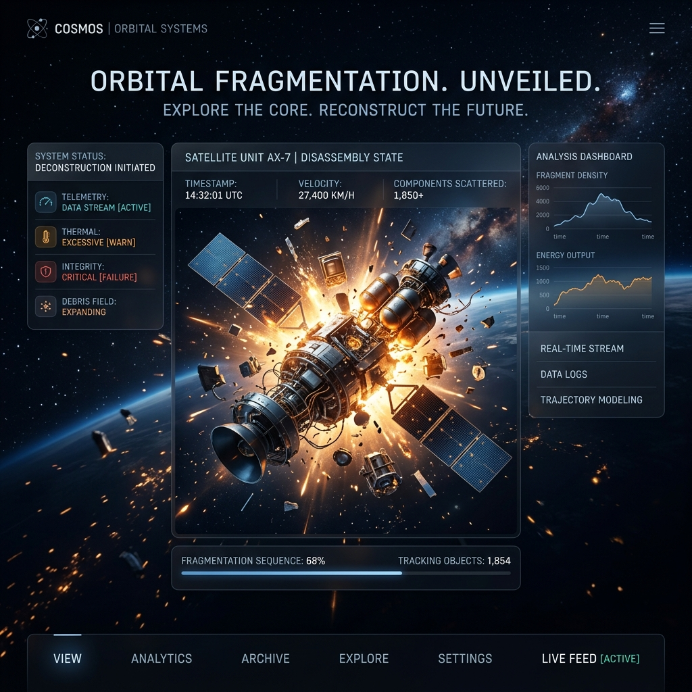
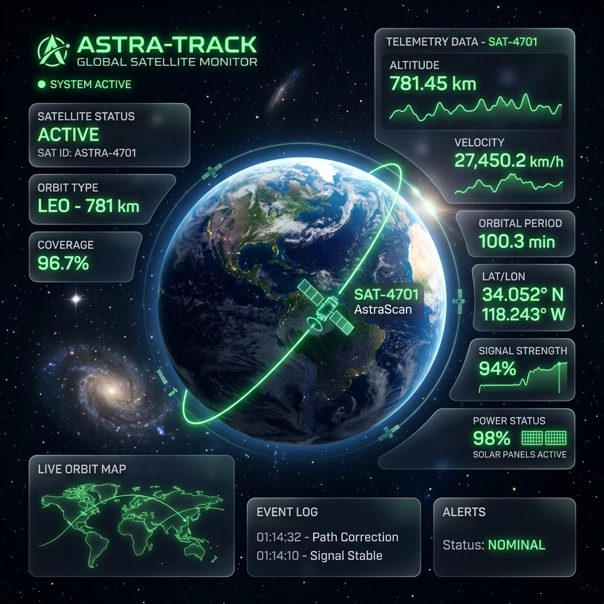
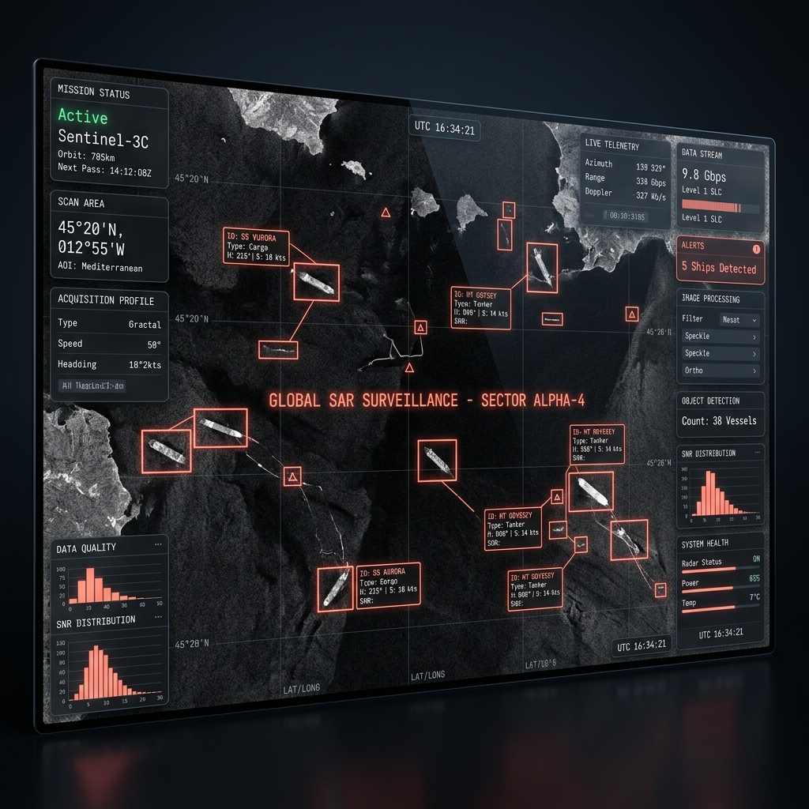

# Singapore Space — Next-Gen Mission Control



A high-fidelity, interactive "Tactile Glass" landing page and dashboard for the **Singapore Space** initiative. This project transitions from a static cinematic concept (Phase 1) to a live, data-driven Space Situational Awareness (SSA) monitor (Phase 2), showcasing Singapore's five NEqO satellites (TeLEOS-1, TeLEOS-2, DS-EO, NeuSAR, DS-SAR).

## 🚀 Live Demo

**[View the Live Application on Vercel](https://singapore-space-landing-page.vercel.app/)** *(If configured)*

## ✨ Features

- **Cinematic Scroll Animation:** A highly optimized, scroll-driven 3D satellite disassembly sequence.
- **Sovereign Orbit Tracker:** 
  - Real-time 3D Earth visualization using **CesiumJS**.
  - Live orbital propagation powered by **satellite.js**.
  - Real-time fetching of Two-Line Element (TLE) data from the public **CelesTrak API**.
- **SAR Explorer (Simulated):** A toggleable interface simulating Earth observation feeds, with an "AI Fusion" mode demonstrating automated maritime anomaly detection.
- **SSA Conjunction Engine:** A simulated debris collision monitor, demonstrating how Space Traffic Management operates in low-earth orbit.
- **Space-as-a-Service API Sandbox:** An interactive code editor pane that fires live queries to the backend (via CelesTrak) and renders the raw JSON response directly in the browser.

## 🖼️ Gallery

### Sovereign Orbit Tracker

*Tracking the NEqO constellation in real-time over Southeast Asia using CesiumJS.*

### SAR Explorer & AI Fusion

*Demonstrating synthetic aperture radar interfaces and simulated AI targeting for maritime security.*

## 🛠️ Technology Stack

- **Core:** HTML5, Vanilla JavaScript, CSS3
- **Design System:** Custom CSS Variables ("Tactile Glass" & "Zenith Orbit" palette)
- **3D Visualization:** CesiumJS
- **Orbital Mechanics:** satellite.js (v4.1.4 for Vite compatibility)
- **Build Tool:** Vite
- **Deployment:** Vercel

## ⚙️ Local Development

### Prerequisites
- Node.js (v18+)
- A free [Cesium Ion Token](https://cesium.com/ion/signup)

### Setup

1. **Clone the repository:**
   ```bash
   git clone https://github.com/DSeahYS/Singapore-Space-Landing-Page.git
   cd Singapore-Space-Landing-Page
   ```

2. **Install dependencies:**
   ```bash
   npm install
   ```

3. **Configure Environment Variables:**
   Create a `.env` file in the root directory and add your Cesium token:
   ```env
   VITE_CESIUM_TOKEN=your_cesium_ion_token_here
   ```

4. **Start the development server:**
   ```bash
   npm run dev
   ```

5. **Build for production:**
   ```bash
   npm run build
   ```

## 📐 Design System

This project strictly adheres to a custom premium design system:
- **Glassmorphism:** Frosted glass panels with subtle borders.
- **Skeuomorphism:** Embossed borders, glowing inner shadows, and tactile button feedback.
- **Color Palette:** 
  - *Midnight Blue* (`#191970`) and *Space Black* (`#121313`) for deep contrast.
  - *Neon Green* (`#4ADE80`), *Neon Coral* (`#FF6B6B`), and *Electric Blue* (`#00F0FF`) for accents and status indicators.

## 📄 License
This project is for demonstration and portfolio purposes. Data provided by CelesTrak.
